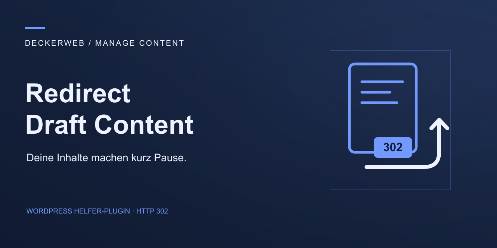

# Redirect Draft Content

## Kurzvorstellung

Redirect Draft Content leitet Aufrufe von Entwürfen vorübergehend auf ein veröffentlichtes Ziel oder eine eigene URL weiter. Das kleine Helfer-Plugin aus der Serie Manage Content erhält die Vorschau für Redakteure und bietet individuelle Ziele je Inhaltstyp.

### Warum ich dieses Plugin gebaut habe

Ein Kunde musste über 300 Blogartikel umstellen und brauchte dafür dringend eine zuverlässige Lösung. Ich habe Redirect Draft Content gebaut, damit Besucher während der Umstellung ein sinnvolles Ziel erreichen, auch wenn Artikel vorübergehend wieder auf Entwurf stehen. Das Plugin wurde dabei zu seinem Rettungsring und hat sich im täglichen Einsatz bestens bewährt.

**Version 0.9.0 · WordPress ≥ 7.1.2 · PHP ≥ 8.2 · GPL v2 oder höher**

[English](README.md) · [FAQ](docs/FAQ-Deutsch.md) · [Wiki](https://github.com/deckerweb/redirect-draft-content/wiki) · [GitHub](https://github.com/deckerweb/redirect-draft-content)

Inhalt: [Auf einen Blick](#auf-einen-blick) · [Erste Schritte](#erste-schritte) · [Funktionen](#funktionen) · [FAQ](#faq) · [Änderungsverlauf](#änderungsverlauf)

## Auf einen Blick

- Echte temporäre Weiterleitungen mit HTTP 302.
- Ziele und Pause-Schalter je Inhaltstyp.
- Veröffentlichte Inhalte suchen, 30 Ergebnisse je Seite.
- Eigene HTTP-/HTTPS-URLs und Live-Vorschau.
- Exakter Pfadabgleich und Schutz vor bekannten Entwurfsschleifen.
- Englisch, Deutsch und Deutsch (Sie).
- deckerweb Library 0.7.0 und deckerweb Updater 2.1.0.

## Erste Schritte

1. Deaktiviere das bisherige Redirect-Draft-Content-Snippet.
2. Lade das Test-ZIP unter Plugins → Installieren → Plugin hochladen hoch und aktiviere es.
3. Öffne Einstellungen → Entwurfsweiterleitung, prüfe die übernommenen Ziele und speichere.
4. Teste eine Entwurfs-URL ausgeloggt. Die Live-Vorschau prüft das Ziel auch vor dem Speichern.

Bei einer bestehenden Plugin-Installation kann das ZIP die bisherige Fassung ersetzen. Die Option `rdc_targets` bleibt erhalten.

## Funktionen

### Ziele und Vorschau

Je Inhaltstyp lässt sich eine vollständige HTTP- oder HTTPS-URL einstellen. Zugangsdaten in URLs und unsichere Protokolle werden abgewiesen. Das Ziel lässt sich vor dem Speichern prüfen. Noch nicht veröffentlichte oder passwortgeschützte Zielinhalte werden nicht verwendet. Externe Weiterleitungsketten können nicht geprüft werden; das Ziel sollte direkt erreichbar sein.

### Umfang und Daten

Ziele werden je Website unter Einstellungen → Entwurfsweiterleitung festgelegt. Die Netzwerkaktivierung kopiert keine Einstellungen und erzeugt keine netzwerkweiten Weiterleitungen. Neue Websites starten ohne Ziele. Es gibt keine Telemetrie. Nur Update-Prüfungen senden technische Anfragen an GitHub; der optionale Online-Katalog der Library ist zunächst ausgeschaltet. Die Weiterleitung selbst benötigt keine externe Anfrage.

## FAQ

### Werden Inhalte dauerhaft verschoben?

Nein. Die Weiterleitungen verwenden HTTP 302. Suchmaschinen entscheiden selbst, wie sie temporäre Weiterleitungen verarbeiten. Der Verbleib einer URL im Index ist nicht garantiert.

### Welche Inhaltstypen werden unterstützt?

Beiträge, Seiten und öffentlich aufrufbare eigene Inhaltstypen, einschließlich verschachtelter Pfade. Anhänge und nicht öffentliche Inhaltstypen sind ausgeschlossen.

### Können Redakteure Entwürfe ansehen?

Ja. Benutzer mit edit_posts oder der Berechtigung zum Bearbeiten des aufgerufenen Entwurfs sind ausgenommen. Vorschau, Feeds, REST, AJAX und schreibende Aufrufe bleiben ebenfalls ausgenommen.

### Kann ich eine externe URL verwenden?

Ja. Je Inhaltstyp lässt sich eine vollständige HTTP- oder HTTPS-URL einstellen. Zugangsdaten in URLs und unsichere Protokolle werden abgewiesen. Das Ziel lässt sich vor dem Speichern prüfen.

### Wie ersetze ich das bestehende Snippet?

Deaktiviere das alte Snippet vor der Plugin-Aktivierung. Die bestehende Option rdc_targets wird direkt übernommen, auch für vorübergehend inaktive Inhaltstypen. Vorhandene Regeln bleiben aktiv, bis sie pausiert werden.

### Funktioniert das Plugin in Multisite?

Ja. Ziele werden je Website unter Einstellungen → Entwurfsweiterleitung festgelegt. Die Netzwerkaktivierung kopiert keine Einstellungen und erzeugt keine netzwerkweiten Weiterleitungen. Neue Websites starten ohne Ziele.

### Was passiert bei der Deinstallation?

Die Einstellungen in rdc_targets und alle Inhalte bleiben erhalten. Repositorybezogene Update-Caches werden entfernt. Die gemeinsame Library berücksichtigt andere installierte Host-Plugins; ihre optionale Einstellungslöschung greift nur beim letzten Host.

[Vollständige FAQ nach Themen](docs/FAQ-Deutsch.md)

## Änderungsverlauf

### 0.9.0 · 2026-10-07

- **Neu:** Temporäre Entwurfsweiterleitungen für Beiträge, Seiten und öffentlich aufrufbare eigene Inhaltstypen, mit individuellen Zielen und Live-Vorschau.
- **Verbessert:** Veröffentlichte Ziele suchen, Weiterleitungen je Inhaltstyp pausieren und bestehende Website-Einstellungen behalten.
- **Verbessert:** Lokale Shade-Grafiken, kompakter Settings-Header und deckerweb Library 0.7.0.
- **Behoben:** Exakter URL-Abgleich, geprüfte Ziele und Schutz vor Weiterleitungen auf dieselbe URL.

### 0.1.0–0.8.0

- **Sonstiges:** Entwicklungs- und Testversionen, unveröffentlicht.

## Projekt und Unterstützung

Entwicklung und Herausgabe: David Decker – DECKERWEB. Dieses Plugin ist ein kleines Werkzeug für temporäre Entwurfsweiterleitungen.

[Fehler melden](https://github.com/deckerweb/redirect-draft-content/issues) · [Fragen](https://github.com/deckerweb/redirect-draft-content/discussions) · [Sicherheit](SECURITY-de.md) · [Ko-fi](https://ko-fi.com/deckerweb) · [Buy Me a Coffee](https://buymeacoffee.com/daveshine) · [PayPal](https://paypal.me/deckerweb)

Copyright © 2026 David Decker – DECKERWEB. GPL-2.0-or-later. Die gemeinsame Library und der Updater stammen von David Decker – DECKERWEB und werden lokal unter derselben Lizenz mitgeliefert. Die Ausgangsfunktionen stammen aus dem vom Plugin-Autor bereitgestellten Helfer-Snippet. SVG-Grafiken sind eigene Werke unter GPL-2.0-or-later; Schriftarten werden nicht mitgeliefert.
