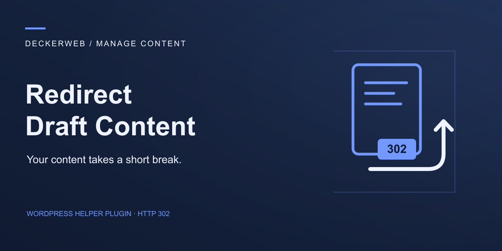

# Redirect Draft Content

## About

Redirect Draft Content temporarily redirects draft requests to a published destination or a custom URL. This small Manage Content helper preserves editor previews and provides individual targets per content type.

### Why I built this plugin

A client urgently needed a reliable way to handle a transition involving more than 300 blog articles. I built Redirect Draft Content so visitors could reach a useful destination while articles were temporarily returned to draft status. It became a lifeline during the transition and worked beautifully in everyday use.

**Version 0.9.0 · WordPress ≥ 7.1.2 · PHP ≥ 8.2 · GPL v2 or later**

[Deutsch](README-de.md) · [FAQ](docs/FAQ-English.md) · [Wiki](https://github.com/deckerweb/redirect-draft-content/wiki) · [GitHub](https://github.com/deckerweb/redirect-draft-content)

Contents: [At a glance](#at-a-glance) · [Getting started](#getting-started) · [Features](#features) · [FAQ](#faq) · [Changelog](#changelog)

## At a glance

- Temporary HTTP 302 redirects.
- Individual destinations and pause switches per content type.
- Published-target search, 30 results per page.
- Custom HTTP/HTTPS URLs and live previews.
- Exact route matching and protection against known draft loops.
- English, German and formal German.
- deckerweb Library 0.7.0 and deckerweb Updater 2.1.0.

## Getting started

1. Disable the existing Redirect Draft Content snippet.
2. Upload the test ZIP through Plugins → Add Plugin → Upload Plugin and activate it.
3. Open Settings → Draft Redirect, review the retained destinations and save.
4. Test a draft URL while logged out. Live previews also work before saving.

An existing plugin installation can be replaced using the ZIP. The `rdc_targets` option remains intact.

## Features

### Destinations and preview

An administrator can configure a complete HTTP or HTTPS URL for each content type. Credentials and unsafe protocols are rejected. Preview the destination before saving. Unpublished or password-protected target items are not used. External redirect chains cannot be checked; choose a directly accessible destination.

### Scope and data

Configure destinations in Settings → Draft Redirect on each site. Network activation loads the helper across sites without copying settings or adding network-wide redirects. New sites start without destinations. There is no telemetry. Update checks contact GitHub for technical release information; the optional online Library catalog starts disabled. Redirect processing requires no external request.

## FAQ

### Does this permanently move content?

No. Redirects use HTTP 302. Search engines decide how to process temporary redirects; retaining an indexed URL is not guaranteed.

### Which content types are supported?

Posts, pages and publicly viewable custom post types, including hierarchical paths. Attachments and nonpublic types are excluded.

### Can editors preview drafts?

Yes. Users with edit_posts or permission to edit the requested draft are exempt. Preview, feed, REST, AJAX and write requests are excluded.

### Can I use an external URL?

Yes. An administrator can configure a complete HTTP or HTTPS URL for each content type. Credentials and unsafe protocols are rejected. Preview the destination before saving.

### How do I replace the existing snippet?

Disable the old snippet before activating this plugin. The existing rdc_targets option is read directly, including settings for temporarily inactive content types. Existing rows remain enabled until paused.

### Does it work on Multisite?

Yes. Configure destinations in Settings → Draft Redirect on each site. Network activation loads the helper across sites without copying settings or adding network-wide redirects. New sites start without destinations.

### What happens on uninstall?

Your rdc_targets settings and all content remain. Repository-specific updater caches are removed. Shared Library cleanup respects other installed hosts; its optional settings deletion only applies to the last host.

[Complete FAQ by topic](docs/FAQ-English.md)

## Changelog

### 0.9.0 · 2026-10-07

- **New:** Temporary draft redirects for posts, pages and publicly viewable custom post types, with individual destinations and live previews.
- **Improved:** Search published targets, pause each content type and keep existing site settings.
- **Improved:** Local Shade artwork, a compact settings header and deckerweb Library 0.7.0.
- **Fixed:** Exact route matching, validated targets and protection against self-redirects.

### 0.1.0–0.8.0

- **Misc:** Development and test versions; not publicly released.

## Project and support

Developed and published by David Decker – DECKERWEB. This plugin is a small tool for temporary draft redirects.

[Report bugs](https://github.com/deckerweb/redirect-draft-content/issues) · [Questions](https://github.com/deckerweb/redirect-draft-content/discussions) · [Security](SECURITY.md) · [Ko-fi](https://ko-fi.com/deckerweb) · [Buy Me a Coffee](https://buymeacoffee.com/daveshine) · [PayPal](https://paypal.me/deckerweb)

Copyright © 2026 David Decker – DECKERWEB. GPL-2.0-or-later. The shared Library and updater are by David Decker – DECKERWEB and bundled locally under the same license. Original helper behavior comes from the plugin author's supplied snippet. SVG artwork is original work under GPL-2.0-or-later; no fonts are bundled.
